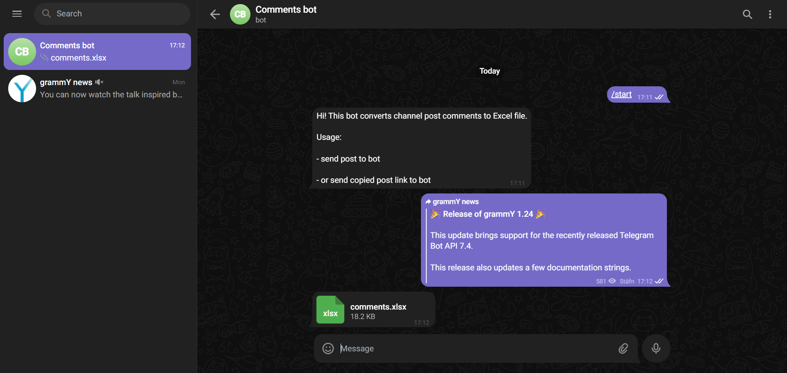

# tgcomments-to-excel-bot

A Node.js Telegram bot that converts Telegram channel post comments to Excel, preconfigured to run in [Vercel Serverless Functions](https://vercel.com/docs/functions).

## Table of Contents

- [Usage](#usage)
- [Built With](#built-with)
- [Installation](#installation)
- [Development](#development)
- [Deployment](#deployment)
- [License](#license)

## Usage



1. Send the post to the bot.
2. Or send the copied post link to the bot.
3. That's it!

## Built With

- [grammY.js](https://grammy.dev)
- [gram.js](https://gram.js.org)
- [xlsx.js](https://sheetjs.com)

## Installation

### Prerequisites

- Node.js (v14 or higher)
- npm (v6 or higher)

### Steps

1. **Clone the repository**

   ```bash
   git clone https://github.com/yuriybahur1/tgcomments-to-excel-bot.git
   cd tgcomments-to-excel-bot
   ```

2. **Install dependencies**

   ```bash
   npm install
   ```

3. **Create a `.env` file**

   Create a `.env` file in the root of the project directory and add the following variables:

   ```env
   BOT_TOKEN=YOUR_BOT_TOKEN
   API_ID=YOUR_API_ID
   API_HASH=YOUR_API_HASH
   ```

4. **Obtain a Bot Token**

   Get the bot token from [BotFather](https://t.me/BotFather) and add it to your `.env` file.

5. **Obtain API ID and API Hash**

   - Log in to your [Telegram account](https://my.telegram.org).
   - Click "API development tools" and fill in the application details (only "App title" and "Short name" are required).
   - Click "Create application".
   - Add the API ID and API Hash to your `.env` file.

6. **Generate a Session**

   Run the following command and follow the instructions, entering your Telegram credentials when prompted:

   ```bash
   npx ts-node utils/getSession.ts
   ```

   After completing the prompts, add the session value to your `.env` file:

   ```env
   SESSION=YOUR_SESSION
   ```

## Development

To start the development server:

```bash
npm run dev
```

## Deployment

Deploying the bot on Vercel is straightforward. Follow the [Vercel documentation](https://vercel.com/docs) for detailed instructions.

The `vercel.json` configuration is already included:

```json
{
  "installCommand": "npm install",
  "buildCommand": "npm run build",
  "outputDirectory": "."
}
```

## License

This project is licensed under the [MIT License](./LICENSE).
