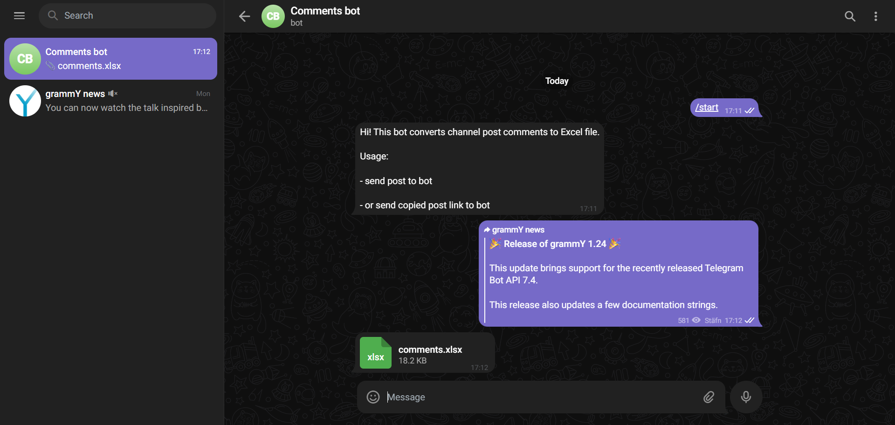

# tgcomments-to-excel-bot

A Node.js Telegram bot that converts Telegram channel post comments to Excel, preconfigured to run in [Vercel Serverless Functions](https://vercel.com/docs/functions).

## Usage



1. Send post to bot.
2. Or send copied post link to bot.
3. That's it!

## Built with

- [grammY.js](https://grammy.dev)
- [gram.js](https://gram.js.org)
- [xlsx.js](https://sheetjs.com)

## Installation

1. Clone the repository:

   ```bash
   git clone https://github.com/yuriybahur1/tgcomments-to-excel-bot.git
   ```

2. **Install dependencies**

   ```bash
   npm install
   ```

3. **Create a `.env` file**

   Create a `.env` file in the root of the project directory.

4. **Obtain a Bot Token**

   The bot requires a Bot Token to handle its logic via [grammY.js](https://grammy.dev). Use [BotFather](https://t.me/BotFather) to get the token, and then add it to your `.env` file:

   ```env
   BOT_TOKEN=YOUR_BOT_TOKEN
   ```

5. **Obtain API ID and API Hash**

   The bot uses API ID and API Hash to fetch Telegram channel post comments via [gram.js](https://gram.js.org). Follow these steps to get them:

   - Log in to your [Telegram account](https://my.telegram.org).
   - Click "API development tools" and fill in the application details (only "App title" and "Short name" are required).
   - Click "Create application".

   Add the API ID and API Hash to your `.env` file

   ```env
   BOT_TOKEN=YOUR_BOT_TOKEN
   API_ID=YOUR_API_ID
   API_HASH=YOUR_API_HASH
   ```

6. **Generate a Session**

   The bot uses a Session to avoid repeated logins to fetch comments. Run the following command and follow the instructions, entering your Telegram credentials when prompted. This is secure; see the [gram.js docs](https://github.com/gram-js/gramjs) and [utils/getSession.ts](./utils/getSession.ts) for more information.

   ```bash
   npx ts-node utils/getSession.ts
   ```

   After completing the prompts, add the session value to your `.env` file:

   ```env
   BOT_TOKEN=YOUR_BOT_TOKEN
   API_ID=YOUR_API_ID
   API_HASH=YOUR_API_HASH
   SESSION=YOUR_SESSION
   ```

## Running the Bot

- **Development mode**

  ```bash
  npm run dev
  ```

- **Production mode**

  ```bash
  npm run build
  ```

## Deployment

Refer to the [Vercel documentation](https://vercel.com) for instructions on how to deploy the bot.

## License

This project is licensed under the [MIT License](./LICENSE).
